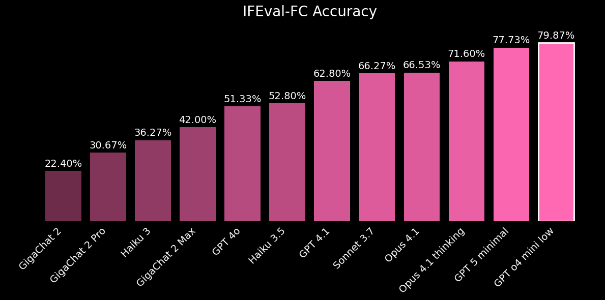
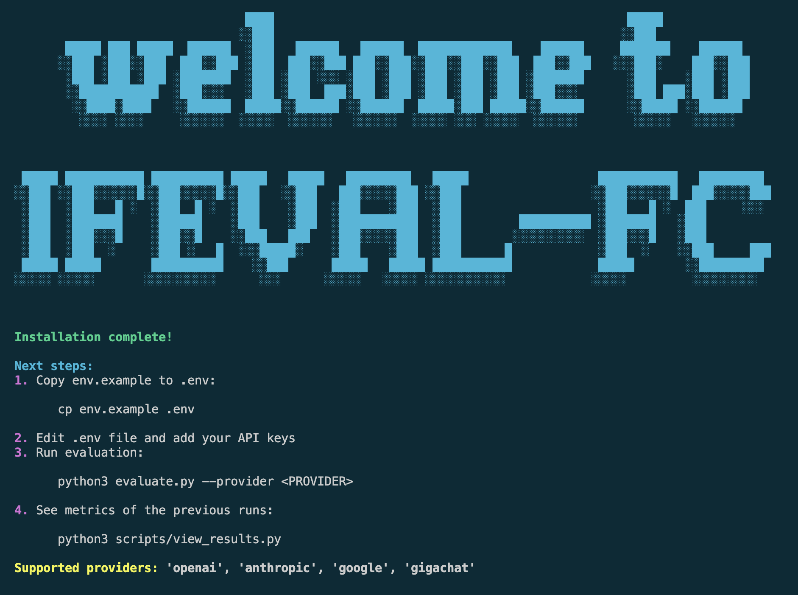
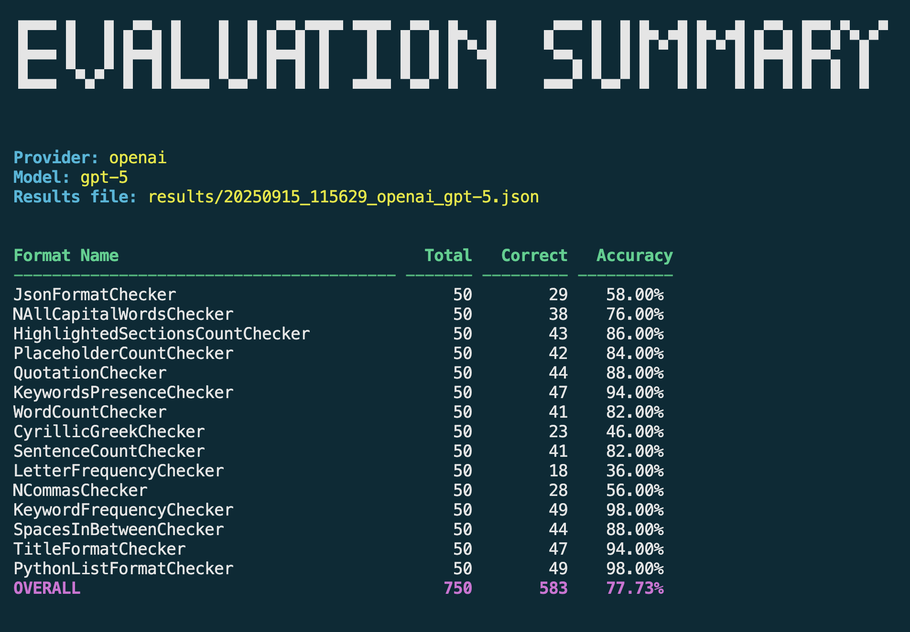

[](https://arxiv.org/abs/2509.18420)
[](https://www.python.org)

# IFEval-FC Leaderboard

<p align="left">
  
</p>

# Benchmark overview

IFEval-FC is similar to IFEval in that it evaluates instruction following, but with an important difference:
it evaluates instruction following specifically in argument values during function calling.

Many formats were taken or adapted from the original IFEval paper, but some new ones were also created.

Every task was synthetically generated via a complex pipeline and further validated (20+ professional annotators were involved).

# Set up and evaluation

1. Prepare an environment
```bash
python3.11 -m venv .venv
source .venv/bin/activate
```
2. Run script to install everything you need
```bash
scripts/./install_dependencies.sh
```

3. Follow the instructions in the welcome message (which will appear after running the installation script above) to reproduce the evaluation:

<p align="left">
  
</p>

# View results

To enhance your experience, we provide a user-friendly results viewer that lets you easily see which formats your model performs best and worst on.

Simply run the command below and follow the prompt to select a results file.

```bash
  python3 scripts/view_results.py
```

<p align="left">
  
</p>


# Appendix

Expanded table showing the evaluation of various models, grouped by instruction type.

| Format | GigaChat 2 | GigaChat 2 Pro | Claude 3 Haiku | GigaChat 2 Max | GPT 4o | Claude 3.5 Haiku | GPT 4.1 | Claude 3.7 Sonnet | claude-opus-4-1-20250805 | Calude Opus 4.1 thinking |  GPT 5 minimal | GPT o4 mini low  |
|---------------------------------|--------------|------------------|---------------------------|------------------|----------|-----------------------------|-----------|------------------------------|----------------------------|-------------------------------------|---------|---------------------------|
|      CyrillicGreekChecker       |    22.00%    |      10.00%      |          30.00%           |      50.00%      |  24.00%  |           40.00%            |  36.00%   |            44.00%            |           40.00%           |               34.00%                | 46.00%  |          70.00%           |
| HighlightedSectionsCountChecker |    38.00%    |      66.00%      |          48.00%           |      72.00%      |  58.00%  |           64.00%            |  88.00%   |            86.00%            |           94.00%           |               100.00%               | 86.00%  |          98.00%           |
|        JsonFormatChecker        |    0.00%     |      0.00%       |          62.00%           |      0.00%       |  40.00%  |           30.00%            |  14.00%   |            34.00%            |           68.00%           |               68.00%                | 58.00%  |           0.00%           |
|     KeywordFrequencyChecker     |    28.00%    |      60.00%      |          36.00%           |      64.00%      |  80.00%  |           76.00%            |  94.00%   |            88.00%            |           90.00%           |               86.00%                | 98.00%  |          92.00%           |
|     KeywordsPresenceChecker     |    54.00%    |      66.00%      |          50.00%           |      84.00%      |  74.00%  |           46.00%            |  90.00%   |            86.00%            |           80.00%           |               90.00%                | 94.00%  |          98.00%           |
|     LetterFrequencyChecker      |    12.00%    |      24.00%      |          22.00%           |      42.00%      |  28.00%  |           28.00%            |  22.00%   |            38.00%            |           28.00%           |               54.00%                | 36.00%  |          86.00%           |
|     NAllCapitalWordsChecker     |    30.00%    |      44.00%      |          28.00%           |      46.00%      |  64.00%  |           78.00%            |  84.00%   |            76.00%            |           20.00%           |               14.00%                | 76.00%  |          90.00%           |
|         NCommasChecker          |    18.00%    |      40.00%      |          14.00%           |      28.00%      |  28.00%  |           12.00%            |  42.00%   |            44.00%            |           52.00%           |               78.00%                | 56.00%  |          82.00%           |
|     PlaceholderCountChecker     |    6.00%     |      40.00%      |           2.00%           |      58.00%      |  12.00%  |           50.00%            |  58.00%   |            76.00%            |           80.00%           |               92.00%                | 84.00%  |          94.00%           |
|     PythonListFormatChecker     |    10.00%    |      2.00%       |          94.00%           |      24.00%      |  72.00%  |           92.00%            |  94.00%   |            68.00%            |           90.00%           |               90.00%                | 98.00%  |          84.00%           |
|        QuotationChecker         |    26.00%    |      0.00%       |          62.00%           |      36.00%      |  18.00%  |           34.00%            |  46.00%   |            66.00%            |           70.00%           |               62.00%                | 88.00%  |          56.00%           |
|      SentenceCountChecker       |    28.00%    |      36.00%      |          26.00%           |      58.00%      |  48.00%  |           56.00%            |  60.00%   |            72.00%            |           84.00%           |               86.00%                | 82.00%  |          78.00%           |
|     SpacesInBetweenChecker      |    2.00%     |      4.00%       |          10.00%           |      8.00%       |  76.00%  |           54.00%            |  72.00%   |            62.00%            |           8.00%            |               24.00%                | 88.00%  |          98.00%           |
|       TitleFormatChecker        |    62.00%    |      64.00%      |          60.00%           |      42.00%      |  76.00%  |           78.00%            |  52.00%   |            90.00%            |          100.00%           |               100.00%               | 94.00%  |          94.00%           |
|        WordCountChecker         |    0.00%     |      4.00%       |           0.00%           |      18.00%      |  72.00%  |           54.00%            |  90.00%   |            64.00%            |           94.00%           |               96.00%                | 82.00%  |          78.00%           |
|             average             |    22.40%    |      30.67%      |          36.27%           |      42.00%      |  51.33%  |           52.80%            |  62.80%   |            66.27%            |           66.53%           |               71.60%                | 77.73%  |          79.87%           |


# TODO

[ ] Try to make the benchmark more difficult: add more available functions (currently, only one function is available and the assistant calls it. It would be more challenging if the assistant had to choose the correct function to call). See if model performance decreases.


# Citation

@misc{skripko2025instructionfollowingevaluationfunctioncalling,
      title={Instruction-Following Evaluation in Function Calling for Large Language Models}, 
      author={Nikolai Skripko},
      year={2025},
      eprint={2509.18420},
      archivePrefix={arXiv},
      primaryClass={cs.AI},
      url={https://arxiv.org/abs/2509.18420}, 
}